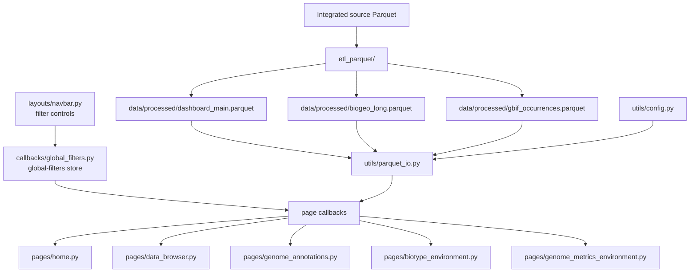
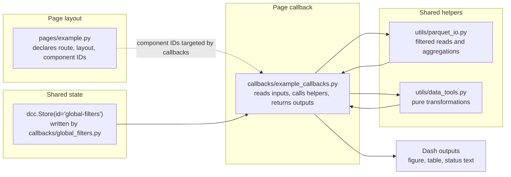

# Biodiversity Genome Annotations Dashboard

Interactive Python Dash application for exploring genome annotation data in ecological context.

The dashboard brings together genome annotation summaries, taxonomy, biogeography, species distribution, and climate variables so researchers and public users can explore how annotated gene biotypes vary across biodiversity and environments.

The app is optimized for processed Parquet datasets using PyArrow predicate pushdown, column pruning, server-side paging, and small process-local caches.

## Mental Model

This repo has two main halves:

1. **ETL pipeline**
   - Reads one integrated, nested source Parquet file.
   - Produces flat dashboard-ready Parquet files in `data/processed/`.

2. **Dash application**
   - Reads the processed Parquet files.
   - Builds one shared global filter store from the navbar controls.
   - Lets each page callback query and aggregate data through shared helpers.

The shortest way to reason about the repo is:

> ETL creates dashboard Parquets. `utils/config.py` names the schema. `layouts/navbar.py` declares global filter controls. `callbacks/global_filters.py` creates the shared filter store. Page callbacks read that store and query Parquet through `utils/parquet_io.py`. Pages render the result.



## Documentation

- Architecture overview: this README
- Adding a page: [`docs/add-a-page.md`](docs/add-a-page.md)

## Quick Start

### Requirements

- Python 3.10+
- Processed Parquet files in `data/processed/`
- Optional for deployment workflows: Docker and `gcloud`

### Install

```bash
python -m venv .venv
source .venv/bin/activate

pip install -r requirements.txt
```

### Run Locally

```bash
# Run dev server
python app.py
# Dash will start at http://0.0.0.0:8050/
```

### Run Tests

```bash
PYTHONPATH=. .venv/bin/pytest -q
```
Expected result: 11 passed.

### Rebuild Parquet Files

If you have a new integrated source Parquet file, rebuild the dashboard-ready files with:

```bash
PYTHONPATH=. .venv/bin/python -m etl_parquet.run_etl_parquet path/to/source.parquet --out-dir data/processed
```
This writes:

```text 
data/processed/dashboard_main.parquet
data/processed/biogeo_long.parquet
data/processed/gbif_occurrences.parquet
```

## Repository Map

```text
.
├── app.py
├── requirements.txt
├── Dockerfile
├── scripts/
│   └── deploy.sh
│
├── assets/
│   ├── styles.css
│   └── image assets used by the navbar/footer
│
├── layouts/
│   ├── navbar.py
│   └── footer.py
│
├── pages/
│   ├── home.py
│   ├── data_browser.py
│   ├── genome_annotations.py
│   ├── biotype_environment.py
│   └── genome_metrics_environment.py
│
├── callbacks/
│   ├── global_filters.py
│   ├── ui_badges.py
│   ├── home_kpis.py
│   ├── data_browser_callbacks.py
│   ├── genome_annotations_callbacks.py
│   ├── biotype_environment_callbacks.py
│   └── genome_metrics_environment_callbacks.py
│
├── utils/
│   ├── config.py
│   ├── parquet_io.py
│   ├── data_tools.py
│   └── types.py
│
├── etl_parquet/
│   ├── run_etl_parquet.py
│   ├── prep_main_parquet.py
│   ├── prep_biogeo.py
│   └── prep_gbif.py
│
├── data/
│   ├── original/
│   ├── processed/
│   └── csv/
│
└── tests/
    └── test_global_filters_helpers.py
```

## Runtime Entry Point

`app.py` creates the Dash app shell. It mounts:
- `dcc.Store(id="global-filters")`
- the shared navbar
- the current page container
- the shared footer
- the Cloud Run health check route

It also imports page modules for Dash validation and imports callback modules so Dash registers their `@callback` functions.

## Layouts And Pages

- `layouts/` contains UI shared across routes.
- `pages/` contains route-level page layouts registered through Dash Pages. These modules should mostly describe UI structure.
- `callbacks/` contains behavior. Page-specific callbacks live beside their page name, while cross-page callbacks live in files such as `global_filters.py` and `ui_badges.py`.

## Shared Utilities

- `utils/config.py` is the schema/config agreement between ETL outputs and app runtime.
- `utils/parquet_io.py` is the data access boundary. It handles Parquet schema discovery, Arrow predicates, filtered reads, paging, counting, distinct values, and aggregations.
- `utils/data_tools.py` contains pure helper logic used by callbacks, including global filter packing helpers, UI labels, KPI helpers, and page-specific transformations.
- `utils/types.py` documents shared dictionary shapes such as `GlobalFilters`.

## ETL Pipeline

`etl_parquet/` converts the integrated source Parquet into dashboard-ready files:

- `dashboard_main.parquet`
- `biogeo_long.parquet`
- `gbif_occurrences.parquet`

The Dash app expects these files in `data/processed/` by default.

## Global Filter Contract

The dashboard uses one shared Dash store for cross-page filter state:

```python
dcc.Store(id="global-filters", storage_type="memory")
```

The `navbar` declares the filter controls, but `callbacks/global_filters.py` is the single writer of this store.
All page callbacks treat the store as read-only input.

### Storage Shape

Keys are included only when a filter is active. Empty selections and full-span sliders are omitted.

```python
{
    "taxonomy_map": {
        "kingdom": ["Animalia"],
        "phylum": ["Chordata"],
        "genus": ["Panthera"],
        "tax_id": ["9689"]
    },
    "climate": ["Tropical"],
    "bio_levels": ["biome"],
    "bio_values": ["Tropical & Subtropical Moist Broadleaf Forests"],
    "climate_ranges": {
        "clim_bio1_mean": [5.0, 25.0],
        "clim_bio12_mean": [500.0, 3000.0]
    },
    "biogeo_ranges": {
        "range_km2": [10000.0, 1000000.0]
    },
    "biotype_pct": {
        "biotype": "lncRNA",
        "min": 5.0,
        "max": 25.0
    }
}
```

**Rules**
- Missing key means no active filter for that category.
- Multiple selected values within a taxonomy rank are treated as OR.
- Different taxonomy ranks are combined as AND.
- Biogeography level/value filters are resolved to accession allow-lists.
- Numeric climate and distribution ranges are inclusive.
- Full-span sliders are treated as neutral and omitted from the store.
- Gene biotype percentage filtering targets one selected biotype at a time.

**Where The Contract Is Used**

- `callbacks/global_filters.py` builds the store.
- `callbacks/ui_badges.py` reads the store to count active filters.
- Page callbacks read the store and pass its values to `utils/parquet_io.py`.
- `utils/parquet_io.py` turns the store values into PyArrow filters, pandas masks, or aggregation inputs.

**Adding A New Global Filter**

When adding a new global filter:

1. Add the UI component in `layouts/navbar.py`.
2. Add it as an `Input` or `State` in `callbacks/global_filters.py`.
3. Extend the store contract with a new key or an existing range group.
4. Update `utils/types.py`.
5. Update `utils/data_tools.py` if store packing/pruning logic is needed.
6. Update `utils/parquet_io.py` so the filter affects data reads.
7. Update relevant page callbacks if they need to unpack the new key.
8. Add or update tests for pure helper logic.

## Page And Callback Pattern

Most dashboard features follow the same three-part pattern:

1. `pages/*.py` declares the visible layout.
2. `callbacks/*_callbacks.py` wires user interaction and rendering.
3. `utils/` contains shared data access and pure helper logic.

This keeps page files mostly declarative and keeps callback files focused on state flow.



### Page Files

Page modules should answer:

- What route does this page register?
- What components appear on the page?
- What component IDs will callbacks target?
- What page-local stores are needed?

Page modules should avoid direct Parquet reads. They should usually not contain filtering or aggregation logic.

Examples:

- `pages/data_browser.py`
- `pages/genome_annotations.py`
- `pages/biotype_environment.py`
- `pages/genome_metrics_environment.py`

### Callback Files

Callback modules should answer:

- Which inputs trigger updates?
- Which outputs are updated?
- How is `global-filters` unpacked?
- Which helper performs the data read or aggregation?
- How is the result converted into Dash component output?

Callback modules may do light orchestration, but reusable logic should move into `utils/data_tools.py` or `utils/parquet_io.py`.

Examples:

- `callbacks/data_browser_callbacks.py`
- `callbacks/genome_annotations_callbacks.py`
- `callbacks/biotype_environment_callbacks.py`
- `callbacks/genome_metrics_environment_callbacks.py`

### Shared Helper Files

Use `utils/parquet_io.py` for:

- reading processed Parquet files,
- building Arrow predicates,
- applying the global filter contract,
- paging rows,
- counting rows,
- distinct value discovery,
- grouped aggregations.

Use `utils/data_tools.py` for:

- pure transformations,
- UI label helpers,
- global filter packing helpers,
- page-local state transformations,
- logic that can be unit tested without running Dash.

### Page-Local State Versus Global State

Use `global-filters` only for filters that should affect multiple pages.

Use page-local `dcc.Store` components for state that belongs to one page only.

For example, Genome Annotations uses:

```python
dcc.Store(id="ga-drill", data={"path": []}, storage_type="memory")
```

That drill path affects only the Genome Annotations chart, so it should not be added to `global-filters`.

For a worked example, see [`docs/add-a-page.md`](docs/add-a-page.md).

## Data Model

The Dash app reads processed Parquet files from `data/processed/`. These files are produced by the ETL scripts in `etl_parquet/`.

### `dashboard_main.parquet`

Main runtime table. One row represents one genome accession.

Used by:

- Home KPIs
- Data Browser
- Genome Annotations
- Biotype vs Environment
- Genome Metrics vs Environment
- global taxonomy, climate, distribution, and biotype filters

Important column groups:

| Group | Columns |
| --- | --- |
| Identity | `accession` |
| Taxonomy | `kingdom`, `phylum`, `class`, `order`, `family`, `genus`, `species`, `tax_id` |
| Gene biotype counts | `*_count`, for example `protein_coding_count`, `lncRNA_count` |
| Gene biotype percentages | `*_percentage`, for example `protein_coding_percentage`, `lncRNA_percentage` |
| Gene total | `total_gene_biotypes` |
| Climate | `clim_bio1_*`, `clim_bio7_*`, `clim_bio12_*`, `clim_bio15_*` |
| Distribution | `range_km2`, `mean_elevation`, `min_elevation`, `max_elevation`, `median_elevation` |
| Genome metrics | ENA genome metrics and Ensembl summary columns exposed by `genome_metric_options()` |
| External links | `biodiversity_portal`, `gtf_file`, `ensembl_browser`, `gbif` |

### `biogeo_long.parquet`

Long-format biogeography table.

Used by:

- global biogeography filters
- Home biogeography KPIs

Columns:

| Column | Meaning |
| --- | --- |
| `accession` | Genome accession matching `dashboard_main.parquet` |
| `level` | Biogeography level: `realm`, `biome`, or `ecoregion` |
| `value` | Region name at that level |

The app uses this file to resolve selected biogeography regions into accession allow-lists.

### `gbif_occurrences.parquet`

Occurrence table prepared for future map/spatial pages.

Columns include:

- `accession`
- `occurrenceID`
- `geo_coordinate`
- `eventDate`
- `elevation`
- `countryCode`
- `iucnRedListCategory`
- GADM location fields
- collection metadata

Current dashboard pages primarily use `dashboard_main.parquet` and `biogeo_long.parquet`.

## Dashboard Features

### Global Filters

The navbar exposes shared filters that apply across dashboard pages:

- taxonomy rank filters from kingdom to species, plus `tax_id`
- biogeography level/value filters for realm, biome, and ecoregion
- numeric climate ranges
- numeric distribution range
- gene biotype percentage range

The filter state is stored in `dcc.Store(id="global-filters")`. See [Global Filter Contract](#global-filter-contract) for implementation details.

### Home

The Home page provides a filtered overview of the dataset:

- distinct taxonomy counts
- distinct biogeography counts
- total annotated genes
- top gene biotypes
- navigation cards for the main dashboard pages

### Data Browser

The Data Browser is a paged table for inspecting matching accessions and metadata:

- selectable column presets
- server-side paging
- global filter support
- clickable external URL columns
- AG Grid column filtering on the currently loaded page

### Biotypes by taxa

The Biotypes by taxa page compares gene biotype composition across taxonomy groups:

- 100% stacked horizontal bar chart
- group by taxonomy rank
- drill down, move up, and reset controls
- click-to-drill chart interactions
- global filter support

### Biotype vs Environment

The Biotype vs Environment page explores relationships between gene biotypes and environmental variables:

- climate scatterplot
- distribution scatterplot
- selectable gene biotypes
- percentage, raw count, and per-1k gene metrics
- optional point sizing by total genes
- optional visual OLS trendlines
- optional log axes

### Genome Metrics vs Environment

The Genome Metrics vs Environment page explores relationships between genome-level metrics and environmental variables:

- climate scatterplot
- distribution scatterplot
- selectable genome metric for the Y axis
- optional point sizing by total genes
- optional visual OLS trendlines
- optional log axes
- optional point cap for dense plots
- global filter support

## Runtime Data Access

The app reads processed Parquet files through `utils/parquet_io.py`. Page callbacks should prefer these helpers over direct Parquet reads so filtering behavior stays consistent across pages.

Current data access patterns:

- PyArrow Datasets provide predicate pushdown and column pruning.
- The Data Browser uses server-side paging before rows are sent to AG Grid.
- Biogeography filters are resolved through `biogeo_long.parquet` into accession allow-lists.
- Numeric climate and distribution ranges become Arrow range predicates.
- Gene biotype percentage filters use precomputed `*_percentage` columns when available, with count-based fallback logic where needed.
- Genome Metrics vs Environment reads selected genome metric columns from `dashboard_main.parquet` and plots them against climate/distribution variables under the active global filters.

Process-local caching is used only for stable, schema-like lookups:

- taxonomy option discovery with `@lru_cache(maxsize=1)`
- numeric column min/max discovery through `parquet_io.get_column_min_max(...)`

Avoid caching helpers that accept mutable or unhashable values such as filter dictionaries.

## Slider Range Initialization

Climate and biogeography sliders are initialized from data extents rather than hard-coded production assumptions.

In `layouts/navbar.py`, sliders call:

```python
utils.parquet_io.get_column_min_max([col])
```

That returns:

```python
{col: (min_value, max_value)}
```

Those values become each slider's `min`, `max`, and initial full-span value.

The full-span value is important: `callbacks/global_filters.py` treats a slider at its full extent as neutral and omits it from `global-filters`. Reset buttons restore sliders to their data-driven full span.

### Add A Numeric Slider

When adding a new global numeric range filter:

1. Add a `_slider_from_col(...)` entry in `layouts/navbar.py`.
2. Add the slider value as an `Input` in `callbacks/global_filters.py`.
3. Add the slider `min` and `max` as `State` values.
4. Extend `gf_build_climate_ranges(...)`, `gf_build_biogeo_ranges(...)`, or add a focused helper in `utils/data_tools.py`.
5. Ensure full-span values are omitted from the store.
6. Update `utils/types.py` if the store shape changes.
7. Update `utils/parquet_io.py` so the new range affects filtered reads.
8. Add tests for the pure helper logic.

For larger page additions, see [`docs/add-a-page.md`](docs/add-a-page.md).

## Typing And Code Structure

The codebase uses Python 3.10+ typing conventions:

- built-in generics such as `dict`, `list`, and `tuple`
- union syntax such as `T | None`
- `TypedDict` for shared dictionary contracts

Central shared types live in `utils/types.py`, including:

- `GlobalFilters`
- `TaxonomyMap`
- `ClimateRanges`
- `BiogeoRanges`
- `BiotypePctFilter`

Keep callbacks thin. Prefer moving reusable, deterministic logic into `utils/data_tools.py`, and keep Parquet reads or aggregations in `utils/parquet_io.py`.

Public helper surfaces are documented with `__all__` in:

- `utils/types.py`
- `utils/data_tools.py`
- `utils/parquet_io.py`

## Testing

The current test suite focuses on pure global filter helper behavior and does not require Parquet data.

Current test file:

- `tests/test_global_filters_helpers.py`

Covered behavior:

- `gf_is_full_span(...)` strict full-span checks
- climate and biogeography range builders
- full-span omission for biotype percentage filters
- global store packing with only active keys
- persistence of climate labels under the `climate` store key

Run tests from the repo root:

```bash
PYTHONPATH=. .venv/bin/pytest -q
```

When adding new behavior, test pure helpers first. Add broader tests when a change touches shared filter behavior, data access contracts, or multiple pages.

## Coding Standards

- Preserve the page/callback/helper split.
- Keep Dash callbacks small and orchestration-focused.
- Put pure helper logic in `utils/data_tools.py`.
- Put Parquet reads and aggregations in `utils/parquet_io.py`.
- Use shared type aliases for shared store/data shapes.
- Avoid new heavy dependencies unless there is a clear product and maintenance reason.
- Avoid background or async behavior unless the architecture is discussed first.
- Treat component IDs and the `global-filters` contract as stable public interfaces within the app.
- Do not change production deployment behavior without human review.

## Next steps

Short-term (non-breaking):

1. Climate categorical labels
   * Integrate external categorization (you’ll prepare this externally).
   * Populate filter-climate options and write selected labels into store key "climate".

2. Interactive Maps
   * Add a page with GBIF occurrences (gbif_occurrences.parquet) and spatial vector layers for realms/biomes/ecoregions. 
   * Likely stack: dash-leaflet or pydeck (lightweight) with server-side query of points. 
   * Tooltips: species, accession, biogeo tags, gene biotypes; respect global filters.

3. Micro-caching (later)
   * Flask-Caching for schema/domains/extents if needed for prod; keep process-local LRU for now.

Nice-to-have:
* CI (pytest + lint) and a “smoke run” workflow.
* Tiny perf polish: cache biotype pct column discovery.

## Known limitations
* Categorical climate labels are placeholders until external source is integrated.
* No map page yet (GBIF points and vector layers to be added).
* Process-local caches reset on app restart (fine for dev/prototype).
