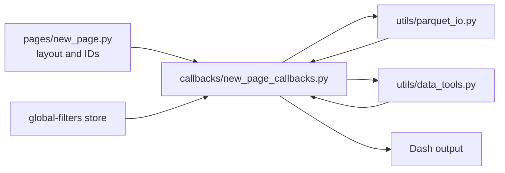

# Add A New Dashboard Page

This guide shows the expected workflow for adding a new page to the dashboard.
It is meant to help maintainers reason about where code belongs before writing
the page itself.

## Purpose

Add a new page when users need a distinct view or workflow that does not fit an
existing page. A page should have a clear question it helps answer, such as:

- Which species match the current global filters?
- How do selected taxa compare across a new environmental variable?
- Where are filtered species occurrences located?

Most new pages should follow the existing page/callback/helper split:

- `pages/` declares layout and component IDs.
- `callbacks/` wires interactions and rendering.
- `utils/parquet_io.py` reads and aggregates processed Parquet data.
- `utils/data_tools.py` contains pure transformations and UI helper logic.

## Before You Start

Answer these questions before adding files:

- What question should this page help users answer?
- Which processed Parquet file does it need?
- Which columns does it need?
- Should global filters apply?
- Does the page need page-local state?
- Can it reuse existing helpers in `utils/parquet_io.py`?
- Does it need new pure helper logic in `utils/data_tools.py`?
- Does it need a navbar link?

## The Standard Pattern

Most page additions touch these files:

```text
pages/new_page.py
callbacks/new_page_callbacks.py
utils/parquet_io.py
utils/data_tools.py
layouts/navbar.py
callbacks/ui_badges.py
app.py
```

Responsibilities:

- `pages/new_page.py`: route registration, layout, component IDs, page-local stores.
- `callbacks/new_page_callbacks.py`: Dash callback inputs, outputs, state flow, rendering.
- `utils/parquet_io.py`: Parquet reads, filters, counts, distinct values, aggregations.
- `utils/data_tools.py`: pure transformations, labels, formatting, page-local helper logic.
- `layouts/navbar.py`: navbar link, if the page should be directly navigable.
- `callbacks/ui_badges.py`: active-link styling, if a navbar link is added.
- `app.py`: callback module import so Dash registers the callbacks.



## Example: Add A Species Summary Page

Example route:

```text
/species-summary
```

Example user goal:

> Show a compact table of species matching the active global filters.

Example data needs:

- `dashboard_main.parquet`
- `species`
- `accession`
- `total_gene_biotypes`
- `range_km2`
- `clim_bio1_mean`
- `clim_bio12_mean`

This example should respect `global-filters` but does not need page-local state.

## Step 1: Add The Page Layout

Create:

```text
pages/species_summary.py
```

Skeleton:

```python
from __future__ import annotations

import dash
from dash import html, dcc

dash.register_page(
    __name__,
    path="/species-summary",
    name="Species Summary",
)

layout = html.Main(
    [
        html.H2("Species Summary", className="home-section-title"),
        html.P(
            "Review species matching the active global filters.",
            className="prose",
        ),
        dcc.Loading(
            type="dot",
            children=html.Div(id="species-summary-content"),
        ),
    ],
    className="page-container",
)
```

Keep the page module focused on layout. Avoid reading Parquet or computing
filtered results here.

## Step 2: Add The Callback Module

Create:

```text
callbacks/species_summary_callbacks.py
```

Skeleton:

```python
from __future__ import annotations

from dash import Input, Output, callback, html

from utils.parquet_io import load_dashboard_page


@callback(
    Output("species-summary-content", "children"),
    Input("global-filters", "data"),
    prevent_initial_call=False,
)
def render_species_summary(global_filters):
    gf = global_filters or {}

    taxonomy_map = gf.get("taxonomy_map") or {}
    levels = gf.get("bio_levels") or []
    values = gf.get("bio_values") or []
    bio_pct = gf.get("biotype_pct") or None
    climate_ranges = gf.get("climate_ranges") or None
    biogeo_ranges = gf.get("biogeo_ranges") or None

    columns = [
        "species",
        "accession",
        "total_gene_biotypes",
        "range_km2",
        "clim_bio1_mean",
        "clim_bio12_mean",
    ]

    df, returned_rows = load_dashboard_page(
        columns=columns,
        page=1,
        page_size=25,
        taxonomy_filter_map=taxonomy_map,
        bio_levels_filter=levels,
        bio_values_filter=values,
        biotype_pct_filter=bio_pct,
        climate_ranges=climate_ranges,
        biogeo_ranges=biogeo_ranges,
    )

    if df.empty:
        return html.Div("No species match the current filters.", className="prose")

    return html.Div(
        [
            html.Div(f"Showing {returned_rows} species rows.", className="status-line"),
            html.Pre(df.to_string(index=False)),
        ]
    )
```

This example uses `load_dashboard_page(...)` because the page is table-like.
For production UI, prefer a styled Dash table, AG Grid, or cards instead of
`html.Pre`.

## Step 3: Add Or Reuse A Data Helper

Before adding a new helper, check whether an existing one already fits:

- `load_dashboard_page(...)` for filtered row projection and paging.
- `count_dashboard_rows(...)` for filtered row counts.
- `distinct_values_for_column(...)` for filtered dropdown domains or KPI counts.
- `summarize_biotypes_by_rank(...)` for grouped gene biotype percentages.
- `summarize_biotype_totals(...)` for top biotype summaries.

Add a new helper to `utils/parquet_io.py` when the page needs a new filtered
read or aggregation pattern.

Add a helper to `utils/data_tools.py` when the logic is pure transformation,
formatting, or state-shaping that can be tested without Dash.

## Step 4: Register The Callback Module

Dash registers callbacks when their modules are imported.

In `app.py`, add the callback import near the other callback imports:

```python
import callbacks.species_summary_callbacks  # noqa: F401
```

Keep this import after the app layout and validation layout are defined.

## Step 5: Add Navigation

If the page should be available from the top navbar, update `layouts/navbar.py`:

```python
dcc.Link(
    "Species Summary",
    href="/species-summary",
    id="nav-species-summary",
    className="nav-link",
)
```

Then update `callbacks/ui_badges.py` so the active-link callback includes the
new nav item.

The callback outputs and return tuple must stay aligned. Add one output:

```python
Output("nav-species-summary", "className"),
```

And return one additional class value:

```python
cls_for("/species-summary")
```

## Step 6: Add Tests

Start with pure helper tests. Avoid testing Dash callback wiring directly unless
the behavior cannot be covered through helper functions.

Example:

```text
tests/test_species_summary_helpers.py
```

Good candidates for unit tests:

- store unpacking helpers,
- formatting helpers,
- empty-data behavior,
- column selection logic,
- page-local state transformations.

Run:

```bash
PYTHONPATH=. .venv/bin/pytest -q
```

## Step 7: Verify Locally

Run the app:

```bash
python app.py
```

Manual checks:

- The new route loads.
- The navbar link works, if added.
- The active nav style works, if added.
- Global taxonomy filters affect the page.
- Global biogeography filters affect the page.
- Numeric climate and distribution ranges affect the page.
- Resetting filters returns the page to a neutral result.
- Empty filter results render clearly.

## Common Pitfalls

- Reading Parquet directly in `pages/*.py`.
- Adding page-specific state to `global-filters`.
- Forgetting to import the callback module in `app.py`.
- Adding a navbar link but not updating `callbacks/ui_badges.py`.
- Hard-coding column names outside `utils/config.py` when they should be shared.
- Assuming `global-filters` keys always exist.
- Returning data that is too large for the browser.
- Adding a new data read path that does not respect global filters.

## Review Checklist

Before merging or releasing a new page:

- The page has a clear user purpose.
- Layout lives in `pages/`.
- Callback behavior lives in `callbacks/`.
- Data reads go through `utils/parquet_io.py`.
- Reusable pure logic lives in `utils/data_tools.py`.
- The page handles missing or empty `global-filters`.
- The page handles empty query results.
- Navigation and active-link styling are updated, if needed.
- Tests cover new helper logic.
- `PYTHONPATH=. .venv/bin/pytest -q` passes.
